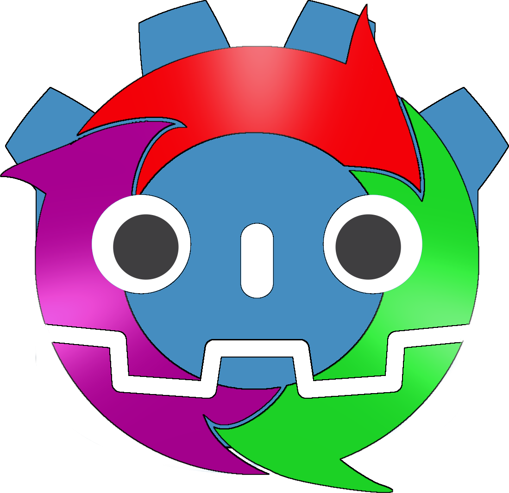

# Welcome to the Godot Wiki
GUT is a unit testing framework for the Godot game engine.

### Wikis
* [GUT <GODOT_3_VERSION> (Godot 3.x)](Godot3/index.html)
* [GUT <GODOT_4_VERSION> (Godot 4.x)](Godot4/index.html)

### Links
* [GUT Github](https://github.com/bitwes/Gut)
* [GUT Tutorials](https://www.youtube.com/channel/UCkGO6guRt_5fOh3oDHbfg9w)  by the one and only me.
* [GUT VSCode Extension](https://marketplace.visualstudio.com/items?itemName=bitwes.gut-extension)

# Contributing
The source for this wiki is located in the [GUT repo](https://github.com/bitwes/Gut).  Currently the Godot 3.x wiki is on the `master` branch.  The Godot 4.x wiki is on the `godot_4` branch.
  

#
